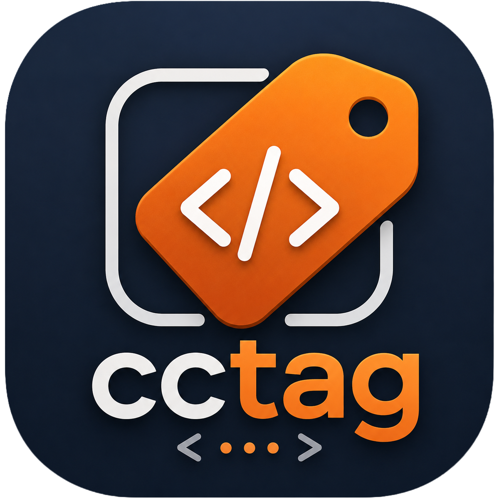

🌐 **日本語** | [English](README.md)

---

# cctag



Slackのスレッドを、**自分のPCでローカルに動いているコーディングエージェントのTUIセッション**
（Claude CodeまたはCodex CLI）に橋渡しするツール。
[Claude Tag](https://www.anthropic.com/news/introducing-claude-tag)がSlackをクラウド上のセッションに
橋渡しするのと同じ発想だが、cctagは*自分自身のターミナル*を動かす点が異なる。

```
Slackスレッド (@cctag)
   ⇅ Socket Mode (@slack/bolt) — 公開サーバー不要
cctagデーモン (Node/TS, 自分のマシン上で動作)
   ├─ 入力:  herdr pane send-text <pane_id> <text> + Enter
   ├─ 検知:  herdr agent get      <pane_id>  (idle / working / blocked / done)
   ├─ 読取:  ペアリング中のエージェント自身のセッショントランスクリプト
   │           Claude Code: ~/.claude/projects/<encoded-cwd>/<session-id>.jsonl
   │           Codex CLI:   ~/.codex/sessions/YYYY/MM/DD/rollout-*-<session-id>.jsonl
   └─ ペアリング: スレッド (channel, thread_ts) ⇔ herdrのpane_id
```

cctagは[herdr](https://herdr.dev)（ターミナルワークスペースマネージャー）経由でペアリング中の
エージェントを操作しており、tmuxの画面をスクレイピングしているわけではない。エージェントの発見、
キー入力の注入、状態検知はすべて`herdr` CLI経由で行う。ターン出力もエージェント自身の構造化された
JSONLトランスクリプトから読み取っており、画面表示をパースしているわけではない。herdrは各paneで
どちらのCLI（`claude`か`codex`）が動いているかを報告してくれるので、cctagは対応するドライバを
自動的に選択する — 1つの`@cctag` botでどちらの種類のセッションともペアリングできる。両者の違いは
[対応エージェント](#対応エージェント)を参照。

## 実際の使われ方

### 1つのセッションを複数人で操作する

スレッドとエージェントのセッションをペアリングしても、そのスレッドで話しかけられる人は制限されない
— そのスレッドにいる誰でも話しかけられる。実際には、専門分野の異なる2人が*同じ*セッションに
直接指示できるということになる。片方がもう片方とAIの間の伝言役になる必要はない。ドメインの専門家が
ドメインの問題について作業させ、エンジニアが同じスレッドで別の実装の質問をする。セッションは
どちらの文脈も拾い上げるので、どちらか一方が相手のために「翻訳」する必要がない。

同じ構図は研究以外の場面でも現れる。クライアントにAIコーディングエージェントを導入する際によくある
失敗パターンは、顧客ディスカバリーとエンジニアリングの両方に長けた1人が必要になってしまうこと
— いわゆる「Forward Deployed Engineer」に近い高いハードルだ。顧客対応の担当者とエンジニアの両方に
1つの共有セッションを操作させることで、このハードルは下がる。顧客対応の担当者がディスカバリーの会話を
進め、エンジニアはより深い技術的判断が必要な部分を担当する。そして顧客対応の担当者はその技術的な
やり取りに間接的にではなく直接立ち会い、徐々に吸収していくので、この役割分担は固定的ではない。
繰り返し使ううちに、顧客対応の担当者は日常的な作業を自分で動かせるだけの習熟度を身につけていき、
エンジニアの役割は本当に必要な決定的な瞬間だけに絞られていく。

### 議論はClaude Tag、実作業はcctag

[Claude Tag](https://www.anthropic.com/news/introducing-claude-tag)（Anthropic公式のSlack bot）も
併用しているなら、この2つは競合せず自然に組み合わさる。Claude Tagは毎回記憶ゼロから始まるが、
共有のGitHubリポジトリがあればそれでも継続性は保てる。リポジトリの既存ドキュメントを見に行かせて
これまでの文脈を拾わせ、スレッドが終わる前に議論の結論のサマリーをリポジトリに push させておく。
cctagはそこから引き継ぎ、長時間かかる作業・リソースを食う作業・サンドボックスではなく自分のマシンの
ツールやファイルが必要な作業を担当する。

cctagはClaude Tagがやっていることを意図的に取り込もうとしない — この2つはワークフローの異なる
地点に位置している。気軽な探索的議論（「ゼミ」）と、長時間の実行タスク（「本番ジョブ」）は
異なるモードであり、同じ環境を共有すべきではないはずだ。両者を1つのツールにまとめようとするのではなく、
普通のGitHubリポジトリでつながった2つのツールとして保つこと自体が狙いであって、埋めるべきギャップではない。

## ステータス

**v0.1。** テキスト入出力のターンは**Claude Code**・**Codex CLI**の両方でend-to-endで動作する。
複数選択肢のプロンプトにも対応しており、ペアリング中のエージェントがツール権限確認（またはCodexの
コマンド承認）メニューを表示すると、cctagはそれをSlackのボタンとして表示し、回答はターミナルに
送り返される。誰かがキーボードから直接答えた場合は、Slackメッセージがその旨を示すように更新される。

仕組みについての補足: どちらのエージェントも、保留中の権限確認・質問プロンプトを、回答され*た後*にしか
セッショントランスクリプトに書き込まない（Claude Codeの`AskUserQuestion`ツール呼び出しは結果と
アトミックに書き込まれる）。そのため保留中のプロンプトはトランスクリプトからではなく、
`herdr pane read`でターミナル画面から直接読み取っている。`src/agents/claude/prompts.ts`と
`src/agents/codex/prompts.ts`参照。

### 対応エージェント

| 機能 | Claude Code | Codex CLI |
|---|:---:|:---:|
| ターン（テキスト入出力） | ✅ | ✅ |
| ツール権限確認・コマンド承認プロンプトのSlackボタン化 | ✅ | ✅ |
| `AskUserQuestion`ボタン＋自由記述回答 | ✅ | — *(対応するツールが存在しない)* |
| `@cctag model` | ✅ `/model <name>` | ✅ モデル＋推論レベルピッカー |
| `@cctag mode` / `@cctag plan` | ✅ | — *(Shift+Tabモードリング・プランモードが存在しない)* |
| ExitPlanModeでのプランファイル添付 | ✅ | — |
| バックグラウンドウォッチャー（ターミナル起点の作業） | ✅ | ✅ |

対応していない機能については、黙って失敗するのではなく、cctagがその旨を返信する
（例: Codexとペアリングされたスレッドでの`@cctag mode plan`）。

仕組みについてのより詳しい解説（研究室の学生向け、Codex対応前に書かれたものだが Claude Code の
内部仕組みについては引き続き正確）— Hub/Spokeの役割分担、herdrのエージェント登録が
生のペインアクセスとどう違うか、AskUserQuestion検知の癖、マルチワークスペース時の注意点など — は
[docs/how-it-works.md](docs/how-it-works.md)（日本語）/
[docs/how-it-works.en.md](docs/how-it-works.en.md)（English）参照。

## cctagの2つの動かし方

- **スタンドアロン** — 自分でSlack appを作成し、1台のマシンで完結させる。cctagを使うのが自分だけなら
  これが一番シンプル。
- **Hub–Spoke** — 1つの共有Slack app、常時稼働の**Hub**を1つ、そして人数分の軽量な**Spoke**。
  同じ`@cctag` botを2人以上で使いたくなった時点で必要になる: SlackのSocket Modeは、
  1つのappの複数の接続のうち*どれか1つ*にしかイベントを配送しない。そのため同じSlack appトークンに
  対して各自がフルのデーモンを動かすと、お互いのイベントを奪い合うだけで共有はできない。Hubは
  唯一のSocket Mode接続を保持し、イベントのルーティングだけを行う — 誰のコーディングエージェント
  セッションも実行しないし、見ることもない。各Spokeは認証済みのWebSocketでHubに接続しに行き、
  スタンドアロンモードと全く同じように、その人自身のローカルなherdr管理下のインスタンス
  （Claude Code、Codex CLI、あるいはその両方）を操作する。

**すでに誰か（指導教員など）が研究室・チーム用のHubを運用している場合**は、下記の
[Spoke利用者向け](#spoke利用者向け)だけで十分 — そこまで読み飛ばして構わない。Slack app関連の
セットアップは一切不要。

## 必要なもの

- **Node.js 20以上** — Hub・Spoke・スタンドアロンいずれの場合もマシン全てで必要。
- **[herdr](https://herdr.dev)** をインストールして起動し、自分のClaude Code・Codex CLIインスタンスを
  herdrのAgentとして登録しておくこと — 実際にこれらのCLIが動くマシン（スタンドアロン、および各Spoke）
  でのみ必要。Hub専用マシンはどちらも一切実行しないため、herdrは不要。
- **Slack appを作成できるワークスペース**（Socket Mode使用、公開サーバーやポート開放は不要）
  — 自分でSlack appを作る場合（スタンドアロン、またはHub運用者）にのみ必要。Spoke利用者はSlack app
  の認証情報には一切触れない。

### herdrのインストール（macOS向け注意点）

herdrのインストールは**どちらか一方の方法だけ**にすること — Homebrewか[公式インストーラ](https://herdr.dev)
のいずれか。両方入れると`herdr`バイナリが2つPATH上に存在することになり、`CCTAG_HERDR_BIN`の指定先が
曖昧になる。

```bash
brew install herdr
brew services start herdr   # herdrはlaunchd経由のバックグラウンドデーモンとして動く
```

自分のターミナルをherdrのAgentとして登録する — Agent名を`--cwd`より*先に*指定する。使いたいCLIごとに
（Claude Code・Codex CLI、あるいはその両方）1回ずつ行う:

```bash
# Claude Code
herdr agent start <name> --cwd <project-dir> -- claude
herdr integration install claude

# Codex CLI
herdr agent start <name> --cwd <project-dir> -- codex
herdr integration install codex
```

Node.jsを`nvm`で管理している場合、launchd経由で起動したherdrデーモンは`.zshrc`/`.zshenv`を読み込まず、
最小限の`PATH`（`/usr/bin:/bin:/usr/sbin:/sbin`）しか持たないため、`claude`/`codex`や`node`を
見つけられない。nvmのbinディレクトリを明示的に渡すこと:

```bash
herdr agent start <name> --cwd <project-dir> \
  --env PATH="$HOME/.nvm/versions/node/<version>/bin:/usr/bin:/bin:/usr/sbin:/sbin" \
  -- claude
```

`herdr agent list`で自分のAgentが`idle`と表示され、`agent`フィールドが期待通り`claude`か`codex`に
なっていることを確認してから先に進むこと。

Codex CLIのセッションIDをherdrに完全に報告させるには、`herdr-agent-state.sh`のSessionStartフックを
一度だけ対話的に信頼する必要がある（統合をインストールした後、Codexを初めて実行した時に出る
承認プロンプト — ディレクトリの信頼ダイアログと同様）。これを行わなくてもcctagは動作する
（ペアリング中ターミナルの作業ディレクトリを手がかりにセッションを探すフォールバックに切り替わる）。

## Hub運用者向け

*（すでに誰かが運用しているHubに接続するだけなら、このセクションは丸ごと読み飛ばして
[Spoke利用者向け](#spoke利用者向け)へ進んでよい。）*

### Slack appの作成

1. `manifest.yaml`から作成: https://api.slack.com/apps → *Create New App* →
   *From an app manifest* → `manifest.yaml`の内容を貼り付け → ワークスペースを選択。
2. **Basic Information → App-Level Tokens** で、`connections:write`スコープを持つトークンを作成。
   これが`SLACK_APP_TOKEN`（`xapp-...`）。
3. appをワークスペースに**インストール**。**OAuth & Permissions**で**Bot User OAuth Token**を
   コピー — これが`SLACK_BOT_TOKEN`（`xoxb-...`）。
4. （任意）**Basic Information → Display Information**で`assets/icon-512.png`をapp iconとして
   アップロード。
5. botをチャンネルに招待: `/invite @cctag`。

### スタンドアロンで動かす

自分のSlackユーザーIDを調べる（プロフィールの三点リーダーメニュー → *Copy member ID*）
— これが`CCTAG_OWNER_USER_ID`。この値のユーザーだけが`connect`/`disconnect`を実行できる。

```bash
cp .env.example .env
$EDITOR .env   # SLACK_BOT_TOKEN, SLACK_APP_TOKEN, CCTAG_OWNER_USER_ID, CCTAG_HERDR_BIN
npm install
npm run dev   # または: npm run build && npm start
```

### Hubを動かす（2人以上で使う場合）

Hubにはスタンドアロンモードと同じ`SLACK_BOT_TOKEN`/`SLACK_APP_TOKEN`に加え、公開された`wss://`
エンドポイントが必要（ドメイン＋その手前のTLS — [Caddy](https://caddyserver.com)ならほぼ設定なしで
自動HTTPSが手に入る）。Oracle Cloudの「Always Free」`VM.Standard.E2.1.Micro`インスタンス1台で十分。
このマシンにherdr・Claude Code・Codex CLIは**不要**。

```bash
git clone https://github.com/moiku/claude-code-tag.git /opt/cctag
cd /opt/cctag && npm install && npm run build
cat > .env <<EOF
SLACK_BOT_TOKEN=xoxb-...
SLACK_APP_TOKEN=xapp-...
CCTAG_HUB_PORT=8765
EOF
```

ドメインをこのマシンに向け（AレコードのみでDNS-only設定にすること — CloudflareなどのProxy経由だと
CaddyがACME/TLSハンドシェイクを完了できない）、Caddyに1行の`/etc/caddy/Caddyfile`を与える:

```
your.domain.example {
	reverse_proxy localhost:8765 {
		transport http {
			dial_timeout 5s
			response_header_timeout 15s
		}
	}
}
```

このタイムアウト明示設定は、資源が限られた無料枠VMでは重要になる。設定がないと、
Hubプロセスが詰まった場合（あるいはメモリ逼迫下でTLSハンドシェイクが詰まった場合）に、
クライアント側は速やかに失敗する代わりに無期限にハングし続けることになる。

再起動後も生き残るよう、systemd配下でHubを動かす（`ExecStart=/usr/bin/node dist/hub/index.js`、
`EnvironmentFile=/opt/cctag/.env`）— テンプレートのunitファイルは`assets/cctag-hub.service`参照 —
その後`systemctl enable --now caddy cctag-hub`。

各利用者にはそれぞれのSlackユーザーIDに紐付いたトークンをHubから発行する — トークンは発行時に
指定したowner以外としては登録できないため、漏洩・誤用されても他人へのなりすましはできない
（ただしそのownerがペアリング済みのスレッドは操作できてしまうので、信頼できる相手にのみ渡すこと）:

```bash
node dist/hub/index.js token issue <name> <ownerUserId>   # トークンを発行して表示
node dist/hub/index.js token list
node dist/hub/index.js token revoke <name>
```

発行したトークン、HubのURL（`wss://...`）、発行時に指定した`ownerUserId`を本人に渡せば、
[Spoke利用者向け](#spoke利用者向け)に必要なものは全て揃う。

### 2つ目のSlackワークスペースを繋ぐ

1つのHubは1つのSlack app/ワークスペース（その`SLACK_BOT_TOKEN`/`SLACK_APP_TOKEN`）にしか
紐付かない。2つ目のワークスペースを繋ぐには、2つ目のHubを動かす — 別マシンは不要で、同じ
マシン上に2つ目の軽量なプロセス（別ポート、別`.env`、別systemd unit）を立てれば十分。

**トークンはHubごとに名前空間が分かれている。** 2つ目のHubを`CCTAG_ENV_FILE=/opt/cctag/.env.workspace2`
のように別の`.env`を指定して起動している場合（チェックアウトを複製するのではなく）、`token issue`/
`list`/`revoke`コマンドにも同じ`CCTAG_ENV_FILE`を付けて実行する必要がある。付け忘れると、
黙って**1つ目**のHubのトークンストアに対して操作してしまう:

```bash
CCTAG_ENV_FILE=/opt/cctag/.env.workspace2 node dist/hub/index.js token issue <name> <ownerUserId>
```

## Spoke利用者向け

*（すでに誰かがHubを運用していて、トークンとHubのURL、Slackユーザーidを渡されただけの人は
このセクションを読めばよい。）*

以下はどれも自分では発行できない — Hub運用者から受け取ること:

- `CCTAG_HUB_URL` — Hubの`wss://...`アドレス
- `CCTAG_SPOKE_TOKEN` — 自分専用に発行されたトークン
- `CCTAG_OWNER_USER_ID` — 自分自身のSlackユーザーID。トークン発行時に指定されたIDと一致していないと
  Hubに接続を拒否される

先に、herdrをインストールして自分のClaude Code・Codex CLIインスタンスをherdrのagentとして
登録しておくこと — 上の[herdrのインストール](#herdrのインストールmacos向け注意点)参照。

```bash
git clone https://github.com/moiku/claude-code-tag.git
cd claude-code-tag
npm install
cp .env.example .env
$EDITOR .env   # CCTAG_HUB_URL, CCTAG_SPOKE_TOKEN, CCTAG_OWNER_USER_ID, CCTAG_HERDR_BIN
npm run build
npm run start:spoke   # 開発中は dev:spoke でも可
```

Spokeは接続が切れても（バックオフしつつ）自動的に再接続する。ペアリング状態は自分のマシンに
ローカルに保存され（`~/.cctag/pairings-<hub-url>.json`、Hubごとに名前空間が分かれる）、Hub側は
「どのスレッドがどのSpokeに属するか」という軽量なマップをメモリ上に持つだけで、各Spokeが接続時に
報告する内容から再構築される。

### 2つ以上のワークスペースに接続する

運用者が複数のHub（例: 2つのSlackワークスペース）を動かしている場合、Hubごとに1つのSpoke、
それぞれ専用のトークンが必要になる。ディレクトリを複製する代わりに、同じチェックアウトから
`CCTAG_ENV_FILE`でインスタンスごとの`.env`を指定して2つ目のSpokeを動かせる —
`CCTAG_HUB_URL`、`CCTAG_SPOKE_TOKEN`、ペアリングの保存先はすべてHub URLごとに自動的に分離される:

```bash
CCTAG_ENV_FILE=/opt/cctag/.env.workspace2 node dist/spoke/index.js
```

常時稼働させる2つ目のインスタンスには、`EnvironmentVariables`/`Environment`で`CCTAG_ENV_FILE`に
その2つ目の`.env`ファイルを指定した、2つ目のlaunchd `LaunchAgent`/systemd unitを追加すること。

同じマシン上の2つのSpokeは、依然として**同じローカルherdrデーモン**と通信するため、同じClaude Code
・Codex CLIインスタンスのプールが見える — 片方のワークスペースであるターミナルをペアリングしても、もう片方の
ワークスペースの選択肢からそのターミナルが消えるわけではない。cctagはこれを別々のSpokeプロセス間で
（1つのSpoke自身のペアリング内でしか）防止しない。同じターミナルを2つのワークスペースから同時に
ペアリングしないこと — キー入力が両方から混ざって送られてしまう。

### トラブルシューティング: 「invalid token」

```
[spoke] disconnected from hub (code 4001: invalid token)
```

これは接続先のHubがそのトークンを認識していないことを意味する — ほぼ常に、接続しようとしている
Hubのプロセスとは別の場所でトークンが発行されたことが原因（別マシン、あるいは複数ワークスペースを
繋いでいるHubなら別ワークスペースのトークンストア — [2つ目のSlackワークスペースを繋ぐ](#2つ目のslackワークスペースを繋ぐ)
参照）。運用者に以下を確認してもらうこと:

- `.env`の`CCTAG_HUB_URL`が、トークンを発行してもらったHubと一致しているか
- `CCTAG_OWNER_USER_ID`が、トークン発行時に指定した`ownerUserId`と完全に一致しているか
- `node dist/hub/index.js token list`を実際のHubマシン上で（複数ワークスペースを繋ぐHubなら
  一致する`CCTAG_ENV_FILE`を付けて）実行した際に、自分の名前が表示されるか

一覧に出てこない場合は、再発行を依頼すること。

### トラブルシューティング: herdr更新後の `protocol_mismatch` / 「インスタンスが見つかりません」

ペアリング済みのセッションに突然一切つながらなくなり、Spokeのログに

```
{"code":"protocol_mismatch","message":"client protocol N is newer than server protocol M; restart the Herdr server ..."}
```

が並ぶ、あるいはSlackの全コマンドが **⚠️ インスタンスが見つかりません** を返す場合、
ほぼ確実に、herdrサーバーが起動したままローカルのherdrが自動更新されたことが原因。
ペアリングをやり直す必要がある問題ではなく、herdr側の問題。2ステップで直る。

**1. herdrサーバーを再起動してクライアントとサーバーのバージョンを揃える。**
`herdr` CLI（クライアント）は新しくインストールされたバイナリだが、バックグラウンドの
`herdr server` プロセスは古いままなので、ワイヤプロトコルが食い違う。サーバー再起動は
pane（実行中のセッション）を巻き込んで終了させるので、作業を保存してから実行すること:

```bash
herdr server stop      # 実行中のpaneが閉じる — 想定どおり
herdr                  # 新バージョンでサーバーを起動し直す
```

その後、Claude Code / Codex エージェントを登録し直し（`herdr agent start ...`、
[herdrのインストール](#herdrのインストールmacos向け注意点)参照）、各スレッドで
`@cctag connect` をやり直す。

**2. cctag が herdr 0.7.5 変更前のものなら更新する。**
herdr 0.7.5（2026-07-21）から、`terminal_id` はエージェントコマンドのターゲットとして
受け付けられなくなり（pane id のみ有効）、`herdr agent send` も削除された
（`agent send-keys` はキー*名*しか受け付けず、自由なテキストは渡せない）。この変更前の
cctag は `terminal_id` でエージェントを指定し `agent send` で入力を送っていたため、
herdr ≥ 0.7.5 ではサーバーを再起動しても全コマンドが失敗する。pane を `pane_id` で
指定し、入力を `pane send-text` で送る現行 cctag に更新すること:

```bash
git fetch origin && git reset --hard origin/main   # `git pull` は不可 — mainの履歴は一度書き換えられている
npm install && npm run build
# その後 Spoke を再起動（launchctl kickstart -k gui/$(id -u)/<自分のSpokeラベル>、
# もしくは npm run start:spoke を実行し直す）
```

この修正を挟んでも Hub↔Spoke 間のワイヤプロトコルは不変なので、新旧どちらの Spoke でも
同じ Hub に対して動作する。各自のタイミングで更新してよく、この件で Hub 自体を
再デプロイする必要はない。

## 使い方

`@cctag`が招待されているSlackチャンネルで、スレッドを開始してbotにメンションする:

| コマンド | 誰が | 何をするか |
|---|---|---|
| `@cctag connect` | owner | 稼働中のherdrエージェント一覧（Claude CodeとCodex CLI）を表示し、このスレッドとペアリングする1つを選ぶ |
| `@cctag disconnect` | owner | このスレッドのペアリングを解除 |
| `@cctag status` | 誰でも | ペアリング中のインスタンスとそのライブ状態を表示 |
| `@cctag list` | 誰でも | 稼働中の全エージェントと、どれがペアリング済みかを一覧表示 |
| `@cctag model <name> [level]` | 誰でも（ペアリング済みスレッド内） | ペアリング中のセッションのモデルを切り替え — Claude Code: `/model <name>`を実行（例: `model opus`）／Codex CLI: モデル＋推論レベルピッカーを操作（例: `model gpt-5.6-sol high`） |
| `@cctag mode <name>` | 誰でも（ペアリング済みスレッド内） | Claude Code専用 — Shift+Tabモードを切り替え: `manual` / `accept-edits` / `plan` / `auto` |
| `@cctag plan` | 誰でも（ペアリング済みスレッド内） | Claude Code専用 — Plan Modeを有効化（`mode plan`と同じ） |
| `@cctag log [instruction]` | 誰でも（ペアリング済みスレッド内） | cctagの最後の投稿以降のスレッドメッセージ（@cctagへのメンションに限らず）をペアリング中のセッションに読み込ませる。instructionを付ければそれも併せて渡す |
| `@cctag <その他の内容>` | 誰でも（ペアリング済みスレッド内） | そのテキストをペアリング中のセッションに送信し、返信をスレッドに投稿する |

`mode`/`plan`は、ペアリング中のスレッドがCodex CLIインスタンスの場合、エラーにはならず
「対応していません」という返信になる。

1つのターミナルにペアリングできるスレッドは同時に1つだけ。単語1つだけのメッセージ
（`connect`, `status`, ...）だけがコマンドとして扱われる — スペースを含むメッセージは、
コマンドの単語で*始まっている*だけのものも含めて、すべてペアリング中のエージェントへのターンとして
送信される。

ペアリング中のエージェントが判断待ちの状態になると、cctagはスレッドにボタンを投稿する:

- **AskUserQuestion**（Claude Code専用）: 選択肢ごとに1つのボタン。クリックするか、スレッドに
  自由記述で返信してカスタムな回答をすることもできる。複数選択（multi-select）の質問はボタンとしては
  表示されない（ターミナル越しにチェックボックスを確実にトグルする方法がまだ堅牢でないため）
  — 選びたい内容をスレッドに文章で返信すること。
- **権限確認・コマンド承認プロンプト**（例: Claude Codeの「`rm -rf ...`を実行しますか？」、
  Codex CLIの「Would you like to run the following command?」）: 選択肢ごとに1つのボタン。
  最初の選択肢はprimaryスタイル、拒否と思われるもの（「No」「Cancel」「拒否」）はdangerスタイルで
  表示される。

### モデルの切り替え

`@cctag model <name> [level]`は会話のターンを開始するのではなく、ペアリング中のセッションのモデルを
直接切り替える — 動作はエージェントによって異なる:

- **Claude Code**: `/model <name>`スラッシュコマンドを直接実行する — 返信はそのコマンド自体の出力
  （例:「Set model to Opus and saved as your default for new sessions」）で、ターミナル画面から
  直接読み取られる。会話の途中でモデルを切り替える際に確認メニュー（「Switch model? Yes/No」）が
  出た場合は自動的に確認される。切り替えを依頼した時点でその意図はすでに明確だからだ。
- **Codex CLI**: `/model <name>`のような引数指定はできず、`/model`は2段階のピッカーを開く
  （まずモデルを選び、次に推論レベル — `low` / `medium` / `high` / `extra high` — を選ぶ。
  どのレベルが選べるかはモデルによって異なる）。cctagがこのピッカーを操作する: `@cctag model
  gpt-5.6-sol high`でモデルとレベルを一度に指定できる。`@cctag model gpt-5.6-sol`のようにレベルを
  省略した場合は、モデルだけ切り替えて現在・既定のレベルはそのままにする。存在しないモデル名・
  レベル名を指定した場合は、実際の画面から読み取った候補一覧を返信する。

### モードの切り替え

*（Claude Code専用 — Codex CLIには対応するモードリングが存在しないため、Codexとペアリングされた
スレッドでは`mode`/`plan`は「対応していません」という返信になる。）*

`@cctag mode <name>`はClaude Codeの4つのShift+Tabモード — `manual`、`accept-edits`、`plan`、`auto`
— のいずれかを選択する。これらにはスラッシュコマンドが存在せず、唯一の操作方法はShift+Tabでの
サイクルなので、cctagはターミナルのフッターから現在のモードを読み取り、目的のモードに達するまで
1回ずつプレスをサイクルさせる（生のbacktab制御シーケンスを使用 — herdrの通常の`send-keys
shift+tab`はClaude Codeに認識されない）。目的のモードに到達できない場合（そのClaude Codeビルドに
存在しない場合）は、その旨を報告し、モードは開始時のまま変更しない。`@cctag plan`は`mode plan`の
省略形。これらのコマンドは、同じインスタンスでターンが進行中の間はブロックされる。

### Slack経由でのPlan Mode

*（Claude Code専用。）*

Plan Modeのターンが終わり、Claude Codeが「ready to code?」の承認プロンプトを表示すると、cctagは:

- 承認ボタンに加えて、**プランをスレッドに添付**する（`~/.claude/plans/`から読み込んだダウンロード可能な
  `.md`ファイルとして）。これにより、ターミナルの表示が折り返されていてもプラン全体を読める。
- **ボタンで承認**できる（proceed / proceed + auto-accept）。
- **スレッドへの返信で変更を指示**できる — 通常の返信はClaude Codeの「変更内容を伝える」経路に
  ルーティングされ、プランを練り直したままplanモードにとどまるので、コードを実行する前にSlack上で
  プランを反復改善できる。

### cctagにメンションされていないスレッドの動きに追いつく

cctagは自分にメンションされたメッセージの文字通りの内容しか見ていない — 他のSlack botやチームメイトが
スレッドの別の場所に投稿したレビューなどは、それ以外の方法では見えない。`@cctag log`はこのギャップを
埋める: cctag自身の最後のメッセージ以降に投稿された全メッセージを（文面から推測するのではなく、
スレッドの実際の履歴を調べて）取得し、それぞれを`sender: text`の形式にフォーマットして
（人間の表示名やbot名を解決した上で）、ペアリング中のセッションにコンテキストとして渡す。
instructionを指定しない場合は「ログの内容に基づいて対応する」がデフォルトの挙動になる。指定した場合
（`@cctag log <instruction>`）は、そのinstructionが追加される。cctagの最後のメッセージ以降に何も
投稿されていない場合は、no-opのターンを開始する代わりにその旨を報告する。

### Slack外で開始された作業

cctagは、Slack起点のターンが進行中の間だけ、ペアリング中のインスタンスを積極的に監視する。
ターミナルで直接何かを開始した場合（一度もペアリングしていない状態、あるいはローカルで開始した
長時間タスクの途中でペアリングした場合など）、バックグラウンドウォッチャー（約7秒間隔でポーリング）が
それが落ち着いた時点（working → idle/done）で気づき、新しい出力を🖥️付きでペアリング中のスレッドに
投稿する。過去の履歴を再生することはないので、作業の途中でペアリングした場合は、ペアリング*以降*に
起きたことだけが報告される。

そのターミナル起点の作業が`AskUserQuestion`・権限確認・（Codex CLIの）コマンド承認プロンプトに
当たった場合、ウォッチャーはそれが自然に解決されるのをただ待つのではなく、Slack起点のメッセージが
使うのと同じターン処理機構にターミナルを引き渡す。そのため、`@cctag`を一度も経由していなくても、
プロンプトはSlackのボタンとして投稿され（スレッドから回答できる）。

複数の質問からなる`AskUserQuestion`プロンプト（Claude Code専用）は、1問ずつ回答される — 回答すると、cctagは画面から
次の質問を読み取る。

## セキュリティに関する注意

ペアリング済みのスレッドに投稿できる人は誰でも、フル権限のローカルコーディングエージェントに任意の
テキストを送り込める。ペアリングはスレッドごとにownerのopt-inで行われ、ownerはいつでも切断でき、
ツールの権限確認プロンプトもSlackのボタンによる人間の承認を必要とする — 何も無人では実行されない。
信頼できる人がいるチャンネルのスレッドでのみペアリングすること。

## License

MIT — `LICENSE`参照。
